# Two-level Grammar of JinXML

## Overview
JinXML has a whitespace insensitive layout, which means that it is a good idea to split the syntax into two phases: a lower-level tokenisation phase and an upper level parsing phase. This page describes both levels for JinXML in [EBNF](https://en.wikipedia.org/wiki/Extended_Backus%E2%80%93Naur_form) and also illustrates the grammars with railroad diagrams, courtesy of the excellent [Railroad Diagram Generator](http://bottlecaps.de/rr/ui). 

## Upper-Level Grammar in EBNF, corresponds to parse phase
```
JinXML ::= Element | JSON
Element ::= StartTag ( ( Entry | JinXML ) Terminator? )* EndTag | FusedTag
StartTag ::= '<' ElementName Attribute* '>'
EndTag ::= '</' ElementName '>'
FusedTag ::= '<' ElementName Attribute* '/>'
ElementName ::= NCName | '&' | String
Attribute ::= FieldPrefix String
NCName ::= [http://www.w3.org/TR/xml-names/#NT-NCName]
JSON ::= Reserved | Number | String | Array | Object
Reserved ::= 'null' | 'true' | 'false'
Array ::= '[' ( JinXML Terminator? )*  ']'
Object ::= '{' ( Entry Terminator? )* '}'
Entry ::= ( NCName | String ) ( ':' | '=' | '+:' | '+=' ) JinXML 
Entry ::= '&' ( ':' | '=' | '+:' | '+=' ) Element
Terminator ::= ',' | ';'
```

The following side-conditions apply:
* ElementNames in paired tags must not differ, where ```&``` is considered to automatically match.
* ```&``` can only be used in a StartTag when its element appears on the right of an Entry.
* ```&``` can only be used as an Entry name when followed by a named StartTag (not ```&```).

## Top Level Grammar as Railroad Diagram

__JinXML__: JinXML is the non-terminal through which all recursion happens

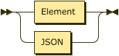

__Element__: Element are made up of tags

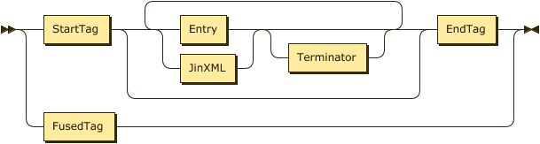

__StartTag__: Must be paired with an EndTag

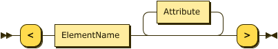

__EndTag__: Must be paired with a StartTag


__FusedTag__: Combines a start-and-end tag pair when there are no children

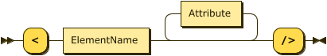

__ElementName__: Element names, attribute keys and object keys are almost identical - but '+' is allowed for element names.

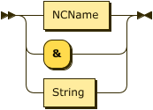

__Attribute__: An attribute pairs up a name with a string value

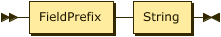

__NCName__: Same as XML spec


__JSON__: Denotes a JSON-styled expression

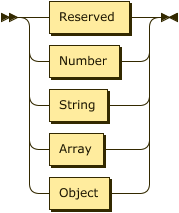

__Reserved__: JSON reserves null, true and false

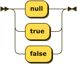

__Array__: JSON-style array brackets


__Object__: JSON-style object brackets

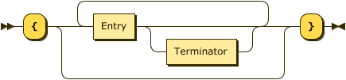

__Entry__: Member of JSON-style object


__Terminator__: Optional comma or semi between members of arrays, objects or elements.

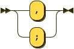


## Lower-Level Grammar for Tokenisation in EBNF, corresponds lexical analysis phase
Note that Shebang sequences may only occur at the start of a stream. 

```
Reserved ::= 'null' | 'true' | 'false'
Number ::= '-'? [0-9]+ ( '.' [0-9]+ )? ( ( 'e' | 'E' ) [0-9]+ )?
String ::= SingleQuotedString | DoubleQuotedString
DoubleQuotedString ::= '"' ([^"\]|BEscape)* '"' | "'" ([^'\]|BEscape)* "'"
BEscape ::= '\' ( ["'\/bfnrt] | 'u' Hex Hex Hex Hex | Reference )
StringQuotedString ::= "'" ([^&>"]|XEscape)* "'"
XEscape ::= '&' (NamedCharacterReference|'#' [0-9]+|'#x' Hex+|'\' BEscape)';'
NamedCharacterReference ::= [http://www.w3.org/TR/html5/syntax.html#named-character-references]
Hex ::= [0-9a-fA-F]
Discard ::= ( Whitespace | XComment | XOther | JComment )+
XComment ::= '<!--' ( [^-]* | '-'+ [^->] )* '-'* '-->' 
XOther ::= '<' [?!] [^>]* '>' 
JComment ::= LongComment | EoLComment
LongComment ::=  '/*' ( [^*] | '*'+ [^*/] )* '*'* '*/'
EoLComment ::= '//' [^#xA]* #xA
Whitespace ::= (#x20 | #x9 | #xD | #xA)+
Shebang ::= ('#!' [^#xA]* #xA)+
```

## Lower-Level Grammar for Tokenisation as Railroad Diagrams

__Reserved__: identifiers that play the role of literal constants


__Numbers__: Only base 10 so far

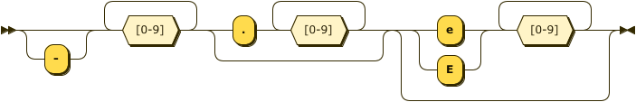

__Strings__: Single and double quoted strings and their symmetrical escape sequences

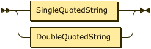

__DoubleQuotedString__: JSON-like double-quoted strings

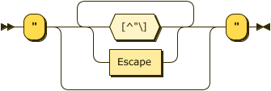

__BEscape__: JSON-style Escapes


__SingleQuotedString__: XML-like single-quoted strings


__XEscape__: XML-style Escapes

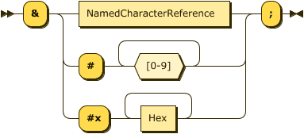

__NamedCharacterReference__: 


__Hex__: Hex Characters

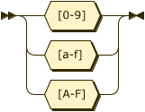

__Discards__: Tokens to be discarded

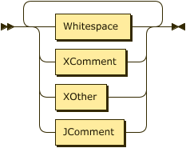

__XComment__: XML-style comment


__XOther__: Other XML-content to be discarded


__JComment__: JSON-style comment

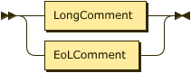

__LongComment__: Multi-line Javascript like comment


__EoLComment__: End of Line Javascript style comment

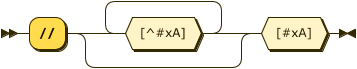

__Whitespace__:

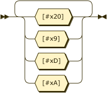

__Shebang__:

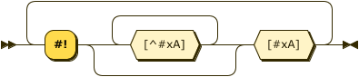
