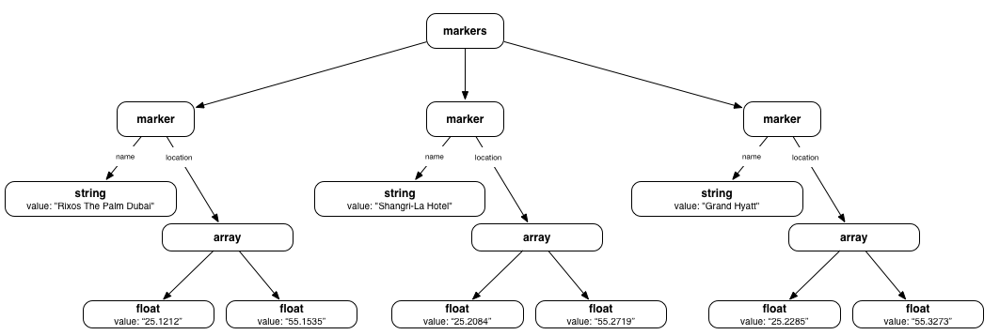

Tips on How to Work with JinXML
===============================

Picturing JinXML as a Tree of Objects
-------------------------------------
In the introduction we had the following example converted from JSON. It's a very light-touch conversion as a number of bad JSON habits are still present e.g. using selectors to implicitly determine the type of object. But it is a good example to visualise:

```xml
	<markers> 
	    <marker>
	        /* When a field has multiple values it's natural to use parentheses */
	        name:       "Rixos The Palm Dubai",
	        location:   [ 25.1212, 55.1535 ]
	    </marker>
	    <marker>
	        // Commas can be omitted or swapped for semi-colons. 
	        name:       'Shangri-La Hotel';
	        location:   [ 25.2084 55.2719 ]
	    </marker>
	    <marker>
	        <!-- Trailing commas are allowed. Also single-quotes, as in HTML. -->
	        name:       "Grand Hyatt";
	        location:   [ 25.2285, 55.3273, ]
	    </marker>
	</markers>
```

The following picture illustrates how JinXML encourages you to think about data as a tree of objects. The element name (in bold) tells you the type of the object and the attributes give details. The links between objects are mostly anonymous (actually the empty-string) but some are labelled e.g. `name` and `location`. Links that share the same parent and the same name are considered to be ordered (shown left-to-right).



Every JinXML expression can be visualised like this. Even JSON objects and literals naturally fit into this model. That is no coincidence but one of the central goals of JinXML - to provide a unified internal model for JSON and (minimal) XML. 

How To Recursively Edit an Element
----------------------------------
We often want to process a tree in place, searching for things we want to change and modifying them. To illustrate how to do this, here's an example that replaces all instances of "http:// with "https://" in a modifiable tree using the Java API.


	void replaceHttpWithHttps( Element element ) {
		if ( element.isStringValue() ) {
			element.setStringValue( element.getStringValue().replace( "http://", "https://" ) );
		}
		for ( Member m : element.members() ) {
			replaceHttpWithHttps( m.getChild() );
		}
	}


How to Recursively Transform an Element into a new Element
----------------------------------------------------------
Just as often we do not want to edit a tree but to create a new tree using a systematic transformation. We could adapt the above code simply by using explicit copying:

```java
Element transformHttpIntoHttps( Element element ) {
	return element.deepMutableCopy().replaceHttpWithHttps();
}
```

Or we can try to write it in a more functional style by constructing a new tree bottom-up. Because elements can be quite complex, we do this with a builder.

```java
Element transformHttpIntoHttps( Element element ) {
	if ( element.isStringValue() ) {
		return Element.newStringValue( element.getStringValue().replace( "http://", "https://" ) );
	} else {
		Builder builder = Element.newBuilder( element.getName(), element.attributes() );
		for ( Member m : element.members() ) {
			String selector = m.getSelector();
			Element child = m.getChild();
			builder.include( selector, transformHttpIntoHttps( child ) );
		}
		return builder.newElement();
	}
}
```

Alternatively we could use mapChildren to write this quite neatly with lambdas:

```java
Element easyTransform( Element element ) {
	if ( element.isStringValue() ) {
		return Element.newStringValue( element.getStringValue().replace( "http://", "https://" ) );
	} else {
		return element.mapChildren( e -> easyTransform( e ) );	
	}
}
```

Deep Freeze
-----------
A common programming pattern is to set-up an element step-by-step and then, once it is set up, use it without changing it. If we work in this way, the newly formed element will be mutable, meaning it remains open to change, and mutable elements are more expensive (and less safe) to work with. So if we don't need to modify an element after it has been created we can freeze or even deep freeze it.

```java
Element e = Element.newElement( "ItemList" );
//	Add a lot of children.
for ( int i = 0; i < string.length; i++ ) {
	e.addLastChild( Element.newStringValue( string.substring( i ) ) );
}
//	Deep freeze it - neither it or its children can be modified.
e.deepFreezeSelf();
```

Freezing is a one-way operation.
