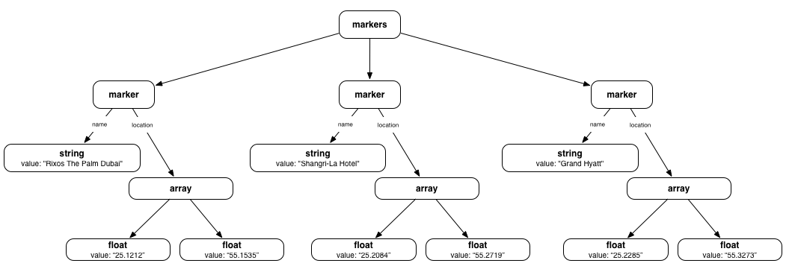

Programming Cheatsheet (Java)
=============================

How to visualise JinXML - as a Tree of Objects
----------------------------------------------
On the site page of the web site, we have the example shown below. It is a light-touch conversion from JSON. Although some bad JSON habits are still present (e.g. using selectors to implicitly determine the type of object) it is a good example to visualise:

```xml
	<markers> 
	    <marker>
	        /* When a field has multiple values it's natural to use parentheses */
	        name:       "Rixos The Palm Dubai",
	        location:   [ 25.1212, 55.1535 ]
	    </marker>
	    <marker>
	        // Commas can be omitted or swapped for semi-colons. 
	        name:       'Shangri-La Hotel';
	        location:   [ 25.2084 55.2719 ]
	    </marker>
	    <marker>
	        <!-- Trailing commas are allowed. Also single-quotes, as in HTML. -->
	        name:       "Grand Hyatt";
	        location:   [ 25.2285, 55.3273, ]
	    </marker>
	</markers>
```

The picture below illustrates how JinXML encourages you to think about data as a tree of objects. The element name (in bold) tells you the type of the object and the attributes give details. The links between objects are mostly anonymous but some are labelled e.g. `name` and `location`. Links that share the same name are considered to be ordered, which is shown left-to-right in the picture.



Every JinXML expression can be visualised like this. Even JSON objects and literals naturally fit into this model. That is no coincidence but one of the central goals of JinXML - to provide a unified internal model for JSON and (minimal) XML. 

How to Create Elements
----------------------
The JinXML java library lets you build elements up step-by-step, via a builder class or read in a whole tree from an input source. We briefly cover each in turn.

### Via Constructor
The `Element.newElement` static method, from package `com.steelypip.powerups.jinxml` is the lowest level way of constructing an element. It takes an element name (e.g. `"Thing"`) and returns an element that has no attributes and no children, those have to be added subsequently by updating the element.

```java
// Builds <Thing myAttr='myValue'/>
Element thing = Element.newElement( "Thing" );
thing.setValue( "myAttr", "myValue" );
```

### Via Builder
Somewhat higher level is a Builder. These are created with the `Element.newBuilder` static method, which provides a default implementation. Builders implement an event-handler style interface, with different methods corresponding to a 'walk' across the element tree.

```java
Builder builder = Element.newBuilder();
builder.startTagEvent( "Thing" );
builder.attributeEvent( "myAttr", "myValue" );
builder.endTagEvent();
Element thing = builder.next();
```

### Via Parser
The simplest and highest level way to construct elements is to parse an input source, such as a file or a string. You can use `Element.fromString` to parse a string into a single element and `Element.readElement` to read a single element from an input source.

```java
Element thing1 = Element.fromString( "<Thing myAttr='myValue'/>" );
Element thing2 = Element.readElement( new FileReader( '/tmp/thing.jinxml' ) );
```

Slightly more sophisticated is `Element.readElementStream`, which creates a lazy stream of elements that are read from the source on demand.

```java
// This one doesn't actually read the file until you pull from it.
Stream< Element > things = Element.readElementStream( new FileReader( '/tmp/thing.jinxml' ) ); 
Element thing = things.findFirst().get();
```


How to Use Attributes
---------------------
Attributes and members could easily be confused, because of the very symmetrical design of the API. So we have adopted a strict jargon to keep it straight with attributes being keys-and-values and members being selectors-and-children. 

Hence every member of an Attribute has two parts: a _key_ name and a _value_ value. In contrast to XML elements, JinXML allows 'duplicate' attributes that have the same key (and even same key and same value). Attributes with the same key are ordered and can be treated like a list of values.

### Accessing Attributes Invidually

Attributes are accessed via `getValue`, `getFirstValue` or `getLastValue`, each of which have several overloads. The overload `String getValue( String key, boolean reverse, int position, String otherwise )` is the general form from which all the others are derived - but it is rarely used.

```java
Element element = Element.fromString( "<data myKey='alpha' myKey+='beta' myKey+='gamma'/>");
String alpha = element.getValue( "myKey" );
String beta = element.getValue( "myKey", 1 );
String gamma = element.getLastValue( "myKey" );
assert "alpha".equals( alpha ) && "beta".equals( beta ) && "gamma".equals( gamma );

// All the getters have an overload with an 'otherwise' value to return if there's
// no matching key.
String delta = element.getValue( "huh?", "delta" );
assert "delta".equals( delta );
```

### Updating Attributes

Attribute setters are mirrors of their getter counterparts with `setValue`, `setFirstValue`, `setLastValue`. In addition we have methods for adding and removing attributes: `addFirstValue`, `addLastValue`, `removeFirstValue` and `removeLastValue` methods, which are all overloaded in the expected way. 


### Bulk Access for Attributes

Sometimes you want to get all the attributes with a given key `myKey`. The simplest way to accomplish this is to get the values as a list. It is important to note that there are two optional flags, `view` and `mutable`, which both default to false. This implementation is strongly geared towards exploiting frozen (immutable) values and will transparently share underlying values when appropriate.

```java
// This is a completely fresh list which nothing can alter after it is built.
// n.b. It is the same as getValuesAsList( myKey, false, false ).
List< String > immutable_and_independent = getValuesAsList( myKey );

// This is a completely fresh list that can be altered.
List< String > mutable_and_independent = getValuesAsList( myKey, false, true );

// This list can't be changed but it can be altered under the hood via the underlying object.
List< String > immutable_but_dependent = getValuesAsList( myKey, true, false );    

// This list is a true view - you can change it and it can be changed via the underlying object.
List< String > mutable_AND_dependent = getValuesAsList( myKey, true, true );    

```

### Iterating Over Attributes


How To Iterate Over Arrays, Objects and Elements
------------------------------------------------
Under the hood, containers like arrays, objects and elements are all translated into the same kind of thing - an `Element`. You can iterate over the members of these in several different ways. Every member of an Element has two parts: a _selector_ name and a _child_ value.  

For example the object `{ "foo": null, "bar": false }` has members:

  1. selector `"foo"`, child `null`
  2. selector `"bar"`, child `false`

An array such as `[ "left", "middle", "right" ]` has three members:

  1. selector `""`, child `"left"`
  2. selector `""`, child `"middle"`
  3. selector `""`, child `"right"`

An element like `<zoo> mammal = "tiger", mammal += "hyena", reptile = "snake"</zoo>` also has three members:

  1. selector `"mammal"`, child `"tiger"`
  1. selector `"mammal"`, child `"hyena"`
  1. selector `"reptile"`, child `"snake"`

As you might expect this leads to different styles of iteration that are suitable for the different cases.

### Element-like Iteration

Iterating over the members of an Element is naturally very straightforward. The `members` method yields a specialised iterable that efficiently yields `Member` objects, each of which contain the selector and child. Note that `Member` objects are created on the fly, they are _not_ parts of the original.

```java
for ( Member m : element.members() ) {
	// This is especially efficient on frozen elements, by the way.
	String selector = m.getSelector();
	Element child = m.getChild();
	...
}
```

### Array-like Iteration

Iterating over the members of an array is equivalent to iterating over the list of children that share the default selector "".

```java
for ( Element child : arrayLikeElement.children() ) {
	...
}
```

More generally, you can iterate over the children that share selector `mySelector` like this:

```java
for ( Element child : arrayLikeElement.children( mySelector) ) {
	...
}
```

### Object-like Iteration

Sometimes you want to ignore the fact that elements might have multiple member with the same selector and just pick the first one.

```java
for ( Member m : objectLikeElement.firstMembers() ) {
	// Each m has a different selector.
	String selector = m.getSelector();
	Element child = m.getChild();
	...	 
}
```


How To Recursively Modify an Element (in place)
-----------------------------------------------
We often want to process a tree in place, searching for things we want to change and modifying them. To illustrate how to do this, here's an example that replaces all instances of "http:// with "https://" in a modifiable tree using the Java API.

```java
void replaceHttpWithHttps( Element element ) {
	if ( element.isStringValue() ) {
		element.setStringValue( element.getStringValue().replace( "http://", "https://" ) );
	}
	for ( Member m : element.members() ) {
		replaceHttpWithHttps( m.getChild() );
	}
}
```

How to Recursively Transform an Element into a new Element
----------------------------------------------------------
Just as often we do not want to edit a tree but to create a new tree using a systematic transformation. We could adapt the above code simply by using explicit copying:

```java
Element transformHttpIntoHttps( Element element ) {
	return element.deepMutableCopy().replaceHttpWithHttps();
}
```

Or we can try to write it in a more functional style by constructing a new tree bottom-up. Because elements can be quite complex, we do this with a builder.

```java
Element transformHttpIntoHttps( Element element ) {
	if ( element.isStringValue() ) {
		return Element.newStringValue( element.getStringValue().replace( "http://", "https://" ) );
	} else {
		Builder builder = Element.newBuilder( element.getName(), element.attributes() );
		for ( Member m : element.members() ) {
			String selector = m.getSelector();
			Element child = m.getChild();
			builder.include( selector, transformHttpIntoHttps( child ) );
		}
		return builder.newElement();
	}
}
```

Alternatively we could use mapChildren to write this quite neatly with lambdas:

```java
Element easyTransform( Element element ) {
	if ( element.isStringValue() ) {
		return Element.newStringValue( element.getStringValue().replace( "http://", "https://" ) );
	} else {
		return element.mapChildren( e -> easyTransform( e ) );	
	}
}
```

Deep Freeze
-----------
A common programming pattern is to set-up an element step-by-step and then, once it is set up, use it without changing it. However, when we work in this way the newly formed element is mutable and remains open to change. Mutable elements are more expensive (and less safe) to work with. So if we don't need to modify an element after it has been created we can freeze or even deep freeze it.

```java
Element e = Element.newElement( "ItemList" );
//	Add a lot of children.
for ( int i = 0; i < string.length; i++ ) {
	e.addLastChild( Element.newStringValue( string.substring( i ) ) );
}
//	Deep freeze it - neither it or its children can be modified.
e.deepFreezeSelf();
```

Freezing is a one-way operation; once frozen an element cannot be thawed out. Freezing is a 'shallow' operation and only affects a single element. Deep-freezing, by contrast, recursively freezes not just an element but all the children, those children's children, and so on unless the entire tree is frozen. Deep freezing is the commonest and most useful way to use freezing.

